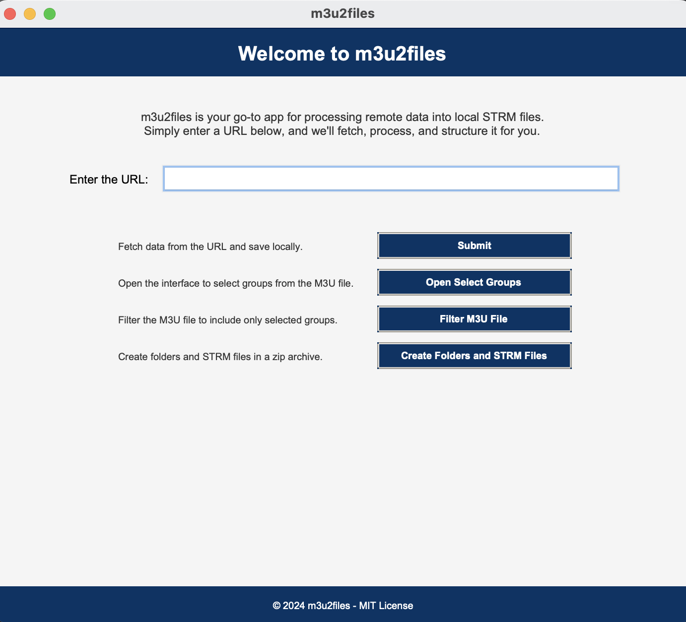

# M3U2Files

**M3U2Files** is an application designed to parse M3U playlists, filter entries based on user selection, and create a file structure that integrates seamlessly with media servers such as Emby and Plex. Each M3U entry is represented as a `.strm` file that points to the content remotely, saving significant storage space while maintaining full functionality for media indexing.

---

## Features

- **M3U Parsing:** Efficiently parse M3U playlists and extract metadata and URLs.
- **User Selection:** Intuitive UI to allow users to select the desired playlist groups.
- **STRM File Creation:** Generate `.strm` files for selected entries, saving disk space.
- **Media Server Integration:** Integrate seamlessly with Emby and Plex for robust media management.
- **Custom File Organization:** Create folder structures based on show names extracted from the playlist metadata.
- **Extensibility:** Built-in support for adding functionality through modular design.

---

## Table of Contents

1. [Demo](#demo)
2. [Installation](#installation)
3. [Requirements](#requirements)
4. [Usage](#usage)
5. [System Requirements](#system-requirements)
6. [Contributing](#contributing)
7. [License](#license)

---

## Demo


*Screenshot of the XtremePlexify UI showing URL submission, filtering options, and STRM file creation.*

---

## Installation

### Clone the Repository
```bash
git clone https://github.com/your-username/M3U2Files.git
cd M3U2Files
```

---

## Requirements

### Python Packages
Ensure you have the following Python packages installed:
- `tkinter` (comes pre-installed with Python on most systems)
- `requests`
- `subprocess` (built into Python)
- `shutil` (built into Python)

### External Tools
- Plex or Emby Media Server for media library indexing.

### Files and Directories
- **Input File:** `data.m3u` (the M3U playlist file to parse)
- **Output File:** `data-filtered.m3u` (filtered M3U playlist)
- **Library Directory:** A directory named `VOD Files` where `.strm` files are created.

---

## Usage

1. **Run the Application**
   Start the application with:
   ```bash
   python main.py
   ```

2. **Submit the M3U Playlist URL**
   - Enter a valid M3U URL into the text box.
   - Click **Submit** to download and save the M3U playlist locally.

3. **Filter M3U Entries**
   - Use the **Filter M3U File** button to process the downloaded playlist.
   - The filtered file will be saved as `data-filtered.m3u`.

4. **Select Groups (Optional)**
   - Click **Open Select Groups** to launch the `select-groups.py` script and choose specific groups from the playlist.

5. **Create STRM Files**
   - Use the **Create Folders and STRM Files** button to generate `.strm` files in a structured directory (`VOD Files`).

6. **Clear Library Directory**
   - Use the **Clear Library Directory** button to remove all folders and files created in the library directory.

---

## System Requirements

- **Operating System:**
  - Windows 10+
  - macOS 11+ (Intel and Apple Silicon)
  - Linux (Ubuntu 20.04+ recommended)

- **Python Version:** 3.8 or higher

- **Network Requirements:**
  - Stable internet connection to fetch M3U files from remote servers.
  - Local network access for Plex or Emby integration.

---

## Project Structure

```plaintext
M3U2Files/
├── main.py                  # Entry point for the application
├── process.py               # Core processing functions
├── select-groups.py         # UI for selecting groups
├── requirements.txt         # Python package dependencies
├── VOD Files/               # Output directory for STRM files
└── README.md                # Project documentation
```

---

## Contributing

Contributions are welcome! Please follow these steps to contribute:

1. Fork the repository.
2. Create a new branch:
   ```bash
   git checkout -b feature-name
   ```
3. Commit your changes:
   ```bash
   git commit -m "Add feature-name"
   ```
4. Push the branch:
   ```bash
   git push origin feature-name
   ```
5. Submit a pull request.

---

## License

This project is licensed under the MIT License. See the `LICENSE` file for details.

---

## Contact

For issues, questions, or suggestions, please open an issue on the [GitHub Issues](https://github.com/your-username/M3U2Files/issues) page.

**Developed with ❤️**
